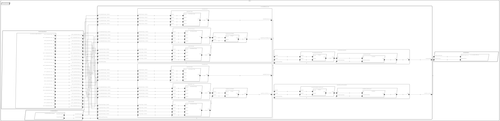

# sysml-rts



**NOTE: you need to be in the directory that contains this readme before running any of the commands below**

## Fetch the AADL SysMLv2 Libraries and the SysMLv2 Models

```bash
git clone --rec https://github.com/santoslab/sysmlv2-models.git
```

## Tool Installation

### Sireum + IVE + VS Code

For Linux/macOS
```bash
(DIR=Sireum && export SIREUM_V=4.20241028.60464f2 && rm -fR $DIR && mkdir -p $DIR/bin && cd $DIR/bin && curl -JLso init.sh https://raw.githubusercontent.com/sireum/kekinian/$SIREUM_V/bin/init.sh && bash init.sh)
export SIREUM_HOME="$(pwd)/Sireum"
export PATH="$SIREUM_HOME/bin:$PATH"
sireum setup vscode 
```

For Windows
```cmd
cmd /V /C "set DIR=Sireum&& set SIREUM_V=4.20241028.60464f2&& (if exist !DIR! rd /S /Q !DIR!) && md !DIR!\bin && cd !DIR!\bin && curl -JLso init.bat https://raw.githubusercontent.com/sireum/kekinian/!SIREUM_V!/bin/init.bat && init.bat"
set SIREUM_HOME="%cd%\Sireum"
set PATH=%SIREUM_HOME%\bin;%PATH%
sireum.bat setup vscode
```

## Build CAmkES + Sireum Docker Image if Targeting Linux or CAmkES

1. Install [Docker Desktop](https://www.docker.com/products/docker-desktop/)
2. Build the image via [bin/docker-setup.cmd](bin/docker-setup.cmd)
   ```
   ./bin/docker-setup.cmd
   ```

This adds a ``camkes.sireum`` image to your docker images.

## Platforms

### JVM

#### IDE Support

1. Open the ``sysmlv2-models`` directory in VS Code

    For macOS
    ```
    open -a "$SIREUM_HOME/bin/mac/vscodium/CodeIVE.app" <sysmlv2-models-directory>
    ```

    For Linux
    ```
    $SIREUM_HOME/bin/linux/arm/vscodium/bin/codeive <sysmlv2-models-directory>
    ```

    For Windows
    ```
    %SIREUM_HOME%\bin\win\vscodium\CodeIVE.exe <sysmlv2-models-directory> 2> nul
    ```

1. Open [RTS.sysml](RTS.sysml) which contains the [RTS system](RTS.sysml#L11).  A pop-up will be displayed on the bottom right of your screen asking you to either locate an existing SysML v2 standard library or download it.  Choose the download option.

1. Rerun HAMR Codegen by clicking the search box at the top of VS Code and then ``Run Task`` >> ``sireum hamr`` >> ``sireum hamr: sysml codegen`` and choose ``JVM`` from the list of available platforms.

1. Open the directory containing the generated Slang project, ie. [hamr/slang](hamr/slang/), in IVE

    macOS
    ```
    open -a "SIREUM_HOME/mac/idea/IVE.app ./hamr/slang
    ```

    Linux
    ```
    $SIREUM_HOME/bin/linux/idea/bin/idea ./hamr/slang 2> /dev/null
    ```

    Windows
    ```
    %SIREUM_HOME%\bin\win\idea\bin\idea.bat .\hamr\slang 2> nul
    ```

    Refer to [hamr/slang/bin/project.cmd](hamr/slang/bin/project.cmd#L47) for instructions on how to run the application and test cases.

    Logika will verify the behavior code when any of the components in the [Actuation](hamr/slang/src/main/component/rts/Actuation/) subsystem are opened in IVE.

#### Command Line Support

Rerun codegen targeting the JVM
```bash
./bin/run-hamr.cmd JVM
```

Compile/run the test cases followed by the JVM application

```bash
sireum proyek test ./hamr/slang

sireum proyek run ./hamr/slang rts.Demo
```

Verify the Actuation subsystem via Logika

```bash
./hamr/slang/bin/run-logika.cmd
```

### Linux


Rerun codegen targeting Linux (alternatively this could be done from inside VS Code)
```bash
./bin/run-hamr.cmd Linux
```

Enter ``CTRL-c`` to exit the application.

Or, compile/run the transpiled C project via the docker image

```bash
./hamr/slang/bin/transpile.cmd
docker run --rm -it -w /root -v $(pwd):/root/sysml camkes.sireum sh -c \
    "sireum slang run /root/sysml/hamr/c/bin/compile.cmd && /root/sysml/hamr/c/bin/slang-build/Demo"
```

NOTE: remove the ``--rm`` option if you want to reuse the container.  Replace ``sh -c ...`` with ``bash`` if you want to enter an interactive shell.

### CAmkES
Rerun codegen targeting seL4

```bash
./bin/run-hamr.cmd seL4
```

Build and simulate the CAmkES image via the docker image

```bash
docker run --rm -it -w /root -v $(pwd):/root/sysml camkes.sireum sh -c \
    "/root/sysml/hamr/camkes/bin/run-camkes.sh -c /root/camkes -s"
```

Type ``CTRL-a x`` to exit the QEMU simulation